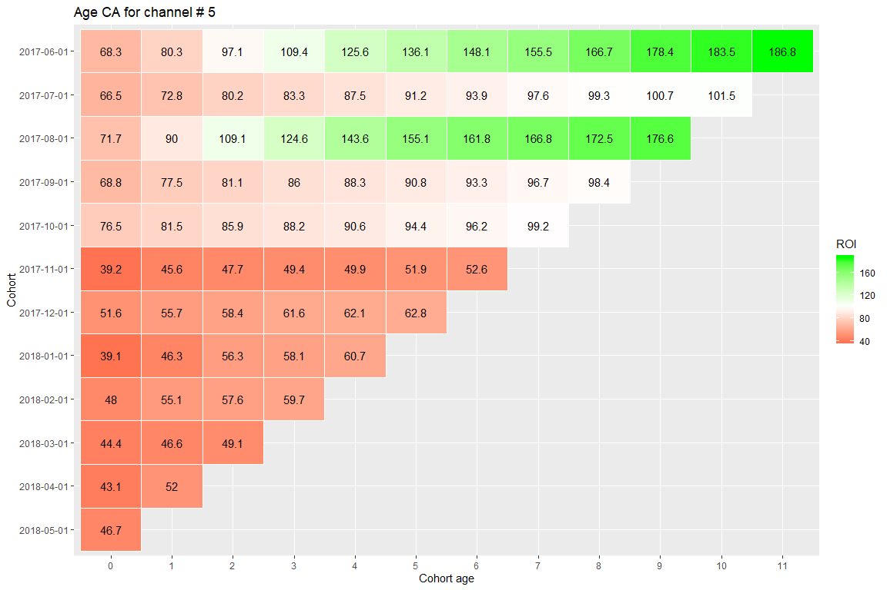

<style>
body {
text-align: justify}
</style>


```r
knitr::opts_chunk$set(echo = TRUE,
                      fig.width = 12,
                      fig.height = 8,
                      warning = FALSE,
                      message = FALSE)
Sys.setlocale(locale = "English")
pacman::p_load(knitr, readr, dplyr, tidyr, lubridate, ggplot2)
```
## Introduction

Sometimes performance evaluation of certain business processes can be obstructed by the time factor. For example, to measure profitability of marketing channels the time of the first visit (or some other action) should be accounted for. If the time span of the data is short and the majority of acquired clients registered during the latest part of the period in question, then those clients simply did not have the opportunity to return the investments. Dividing clients into groups (cohorts) by the time of the required action makes the analysis more reliable. In this document we will explore the data of a movie ticket service and perform simple cohort analysis of marketing channel profitability.

**!NB** Unfortunately, the source that provided me with these data did not revealed the origin of them. Thus, I cannot give credits to the original source.

## Data exploration

First, we load the data. We have 3 data frames:

* marketing costs by channel and date (costs_df),
* web-site sessions with users' ids (vis_df),
* and the orders (ord_df).

Since we would be joining those tables later, we have to prepare them in advance: label similar features with the same names, converting to the required data-type and extracting certain parts of the date-time variables.


```r
# simple function to improve variables' names:
make_names <- function(data, pattern = " ", replacement = "_", ...) {
        names(data) <- tolower(gsub(pattern, replacement, names(data), ...))
        return(data)
}

# costs by channel (source_id):
costs_df <- read_csv("data/costs.csv")

# website visits:
vis_df <-
        read_csv("data/visits_log.csv") %>%
        make_names %>%
        mutate_at(c("start_ts", "end_ts"), ~dmy_hm(.)) %>%
        mutate(year = year(start_ts),
               month = month(start_ts),
               week = week(start_ts),
               date = date(start_ts),
               int = interval(start_ts, end_ts))
# orders
ord_df <-
        read_csv("data/orders_log.csv") %>%
        make_names %>%
        mutate(date = date(buy_ts))

# we can peek at our data frames:
kable(head(costs_df), caption = "Costs", align = "c")
```


Table: Costs

 source_id        dt        costs 
-----------  ------------  -------
     1        2017-06-01    75.20 
     1        2017-06-02    62.25 
     1        2017-06-03    36.53 
     1        2017-06-04    55.00 
     1        2017-06-05    57.08 
     1        2017-06-06    40.39 

```r
kable(head(vis_df[1:5]), caption = "Visits", align = "c")
```


Table: Visits

     uid         device           end_ts           source_id         start_ts       
--------------  ---------  ---------------------  -----------  ---------------------
 1.687926e+19     touch     2017-12-20 17:38:00        4        2017-12-20 17:20:00 
 1.040604e+17    desktop    2018-02-19 17:21:00        2        2018-02-19 16:53:00 
 7.459036e+18     touch     2017-07-01 01:54:00        5        2017-07-01 01:54:00 
 1.617468e+19    desktop    2018-05-20 11:23:00        9        2018-05-20 10:59:00 
 9.969695e+18    desktop    2017-12-27 14:06:00        3        2017-12-27 14:06:00 
 1.600754e+19    desktop    2017-09-03 21:36:00        5        2017-09-03 21:35:00 

```r
kable(head(ord_df), caption = "Orders", align = "c")
```


Table: Orders

       buy_ts           revenue        uid            date    
---------------------  ---------  --------------  ------------
 2017-06-01 00:10:00     17.00     1.032930e+19    2017-06-01 
 2017-06-01 00:25:00     0.55      1.162726e+19    2017-06-01 
 2017-06-01 00:27:00     0.37      1.790368e+19    2017-06-01 
 2017-06-01 00:29:00     0.55      1.610924e+19    2017-06-01 
 2017-06-01 07:58:00     0.37      1.420061e+19    2017-06-01 
 2017-06-01 08:43:00     0.18      1.040239e+19    2017-06-01 

There are no missing values in the datasets. But there are a few mistakes. For instance, some visiting records have date-times with the end happening earlier than the start of the session:


```r
vis_df %>%
        filter(end_ts < start_ts) %>%
        select(uid, ends_with("_ts")) %>%
        kable(caption = "Wrong visiting sessions", align = "c")
```


Table: Wrong visiting sessions

     uid               end_ts                start_ts       
--------------  ---------------------  ---------------------
 1.309215e+19    2018-03-25 03:18:00    2018-03-25 03:50:00 
 4.621203e+18    2018-03-25 03:09:00    2018-03-25 03:55:00 

We'll leave remove those records.


```r
vis_df <- vis_df %>% filter(end_ts >= start_ts)
```

#### Basic questions.

We might be interested in certain exploratory questions.
We will cover those in the following sections.

#### 1. On average how many users visit website per day? ... per week? ... per month?


```r
# little helper-function:
visits <- function(periods, df = vis_df) {
        df %>%
                group_by_at(periods) %>%
                summarise(total_visits = n(),
                          unique_visits = n_distinct(uid),
                          percent_unique = unique_visits / total_visits * 100) %>%
                ungroup %>%
                summarise_at(vars(-periods), ~round(mean(.), 1))
}

kable(visits("date"), caption = "Daily visits:", align = "c")
```


Table: Daily visits:

 total_visits    unique_visits    percent_unique 
--------------  ---------------  ----------------
     985              908              92.7      

```r
kable(visits(c("year", "week")), caption = "Weekly visits:", align = "c")
```


Table: Weekly visits:

 total_visits    unique_visits    percent_unique 
--------------  ---------------  ----------------
    6639.4          5611.9             85.2      

```r
kable(visits(c("year", "month")), caption = "Monthly visits:", align = "c")
```


Table: Monthly visits:

 total_visits    unique_visits    percent_unique 
--------------  ---------------  ----------------
   29877.5          23228.4            78.3      

#### 2. What is the daily average number of sessions per visitor?


```r
vis_df %>%
        group_by(date) %>%
        summarise(vis = n() / n_distinct(uid)) %>%
        .[["vis"]] %>% # this is just for the nicer html output
        mean %>%
        round(2)
```

```
## [1] 1.08
```

Point to note: of course, we can consider the fact that some sessions intervals may fall inbetween 2 distinct dates. However, for the simplicity we will ignore this fact.

#### 3. What is the average duration of a visit?

We can also notice that for the visiting date-times we do not have seconds. We will never know the truth but we can consider 2 extremes: each session has 0 in the seconds holder for sessions longer than 1 minute and 1 second otherwise, or 59 seconds in every case. The following output will be in minutes:


```r
vis_df %>%
        select(int) %>%
        mutate(session_t = int_length(int),
               session_1 = ifelse(session_t == 0, 1, session_t + 1),
               session_59 = session_t + 59) %>%
        summarise(from = mean(session_1) / 60,
                  to = mean(session_59) / 60) %>%
        unlist %>% # unlisting makes the output look better
        round(1)
```

```
## from   to 
## 10.8 11.7
```

#### 4. How long it takes for visitors to buy something after they have visited website?

We will be measuring the time between the first visit and the first order in days and to find the most frequent value we will use mode (the measure of central tendency).

Visits data and order data are in different data frames. We have to match them. This is a difficult task since in both data frames we only have users' IDs and the time of the actions. And because the particular order may have happened during a time interval (so we don't know the exact hour and minute), there may have been visits that occured between 2 different dates, and there may have been multiple visits per user and date (and sometimes orders may have been registered later than they occured) we cannot match both tables directly, or we will end up with duplicates of some records or lose some of the other. Fortunately, we are interested only in the IDs and their respective first-action dates. This means that we can aggregate.

The plan is as follows:
1. For each unique ID find the date of the first visit (the date of the start of the first session).
2. For each unique ID find the date of the first order.
3. Match both data frame by IDs and dates If there is a missing value in the order column, then this means that the visitor never made orders.
4. We substract the order date from the visit date and get the required number for each user.
5. We find the most frequent value.

But first we have to make sure that all the IDs in the orders data frame are in visits too, i.e. the are no mistakes.

```r
setdiff(ord_df$uid, vis_df$uid)
```

```
## numeric(0)
```

So far everyting is in order. Now back to the original question.


```r
lft_df <-
        vis_df %>%
        group_by(uid) %>%
        summarise(vis1 = min(date))

rght_df <-
        ord_df %>%
        group_by(uid) %>%
        summarise(ord1 = min(date))

m_df <-
        left_join(lft_df, rght_df)

m_df %>%
        mutate(diff = ord1 - vis1) %>%
        count(diff) %>%
        drop_na # in case the majority of visitors didn't order anything
```

```
## # A tibble: 349 x 2
##    diff       n
##    <drtn> <int>
##  1 0 days 25039
##  2 1 days  1966
##  3 2 days   685
##  4 3 days   452
##  5 4 days   386
##  6 5 days   307
##  7 6 days   264
##  8 7 days   237
##  9 8 days   216
## 10 9 days   162
## # ... with 339 more rows
```

So it seems that with each passing day since the first visit the chances that an order will be made are decreasing. Quite obvious and expected result.

#### 5. What is the share of buyers?

We already prepared our data, we just need to count non-missing values:


```r
round(prop.table(table(!is.na(m_df$ord1)))["TRUE"], 2)
```

```
## TRUE 
## 0.16
```

#### 6. On average, how many orders does one client do during the first 6 months from her/his first order?

To answer this question we use the original data frame of orders and the aggregated dataset from the 4th question where we figured out the date of the first order for each user. By substracting the date of the order (which is just the the date component of the original date-time variable "buy_ts"), we get the difference in days for each order. Then we can filter out orders that happened later than 6 months from the first order and calculate the average.


```r
coh_df <- 
        left_join(ord_df, rght_df) %>%
        mutate(diff = date - ord1) %>%
        filter(diff <= months(6))

coh_df %>%
        group_by(uid) %>%
        summarise(tickets = n()) %>%
        summarise(`mean_#_tickets` = round(mean(tickets), 2)) %>%
        unlist
```

```
## mean_#_tickets 
##           1.33
```

It looks like the typical user will only by 1 or 2 tickets in the first 6 months of his/her being a client of the service.

#### 7. What is the average check?


```r
round(mean(ord_df$revenue), 2)
```

```
## [1] 5
```

#### 8. On average, how much money does one client bring during the first 6 months from her/his first order?

Of course, we can combine the answers from 2 previous questions...


```r
1.33 * 5
```

```
## [1] 6.65
```

... or we can calculate it from the original data, the results do not differ much:


```r
coh_df %>% 
        group_by(uid) %>%
        summarise(revenue = sum(revenue)) %>%
        summarise(average = round(mean(revenue), 2)) %>%
        unlist
```

```
## average 
##    6.58
```

#### 9. How much is spend on each channel and in total?

In total:


```r
cat("total campaign expenses = ", sum(costs_df$costs))
```

```
## total campaign expenses =  329131.6
```

By channel:


```r
(chan_df <- 
        costs_df %>%
        group_by(source_id) %>%
        summarise(costs = sum(costs)))
```

```
## # A tibble: 7 x 2
##   source_id   costs
##       <dbl>   <dbl>
## 1         1  20833.
## 2         2  42806.
## 3         3 141322.
## 4         4  61074.
## 5         5  51757.
## 6         9   5517.
## 7        10   5822.
```

## Cohort Analysis.

In this case cohort analysis will help us better understand the return on insvestments (ROI) of our channels.
For simple visual representation we will split our data into **monthly** cohorts.

A quick reminder: ROI can be estimated as

$$ROI = \frac{revenue}{costs} * 100 $$

Thus, if our revenue is greater than our costs, ROI will be greater than 100%. Another key concept is the **lifetime value** of a customer (LTV for short). This is simply revenue generated by a single customer over the entire period of his/her relationships with business. In cohorts such a figure can be acquired by division of the total cohort revenue during the month (or any other period) by the cohort size (in users): $$\bar{LTV} = \frac{revenue}{cohort size}$$.

Using this knowledge, we can evaluate channels' profitability.

To accomplish this task, we first assign to each visitor 2 new features: the channel of the 1st visit and the date of the 1st visit. By doing so, we are creating our cohorts:


```r
uid_df <-
        vis_df %>% 
        select(uid, date, source_id) %>%
        group_by(uid) %>%
        summarise(source_id = first(source_id), vis1 = min(date))

kable(head(uid_df), caption = "Visitors with channel and date of the 1st visit", align = "c")
```


Table: Visitors with channel and date of the 1st visit

     uid         source_id       vis1    
--------------  -----------  ------------
 1.186350e+13        3        2018-03-01 
 4.953707e+13        2        2018-02-06 
 2.977294e+14        3        2017-06-07 
 3.135781e+14        2        2017-09-18 
 3.253208e+14        5        2017-09-30 
 3.973998e+14        4        2018-01-18 

Now we can combine this information with the orders to figure out the aggregated monthly revenue for every cohort and channel (source_id):


```r
crev_df <-
        ord_df %>%
        inner_join(uid_df) %>% 
        group_by(cohort_id = floor_date(vis1, "month"),
                 month = floor_date(date, "month"),
                 source_id) %>%
        summarise_at("revenue", ~sum(.)) %>%
        ungroup

kable(head(crev_df), caption = "Monthly revenue in cohorts and channels", align = "c")
```


Table: Monthly revenue in cohorts and channels

 cohort_id       month       source_id    revenue 
------------  ------------  -----------  ---------
 2017-06-01    2017-06-01        1        1168.45 
 2017-06-01    2017-06-01        2        1551.76 
 2017-06-01    2017-06-01        3        2466.71 
 2017-06-01    2017-06-01        4        2039.64 
 2017-06-01    2017-06-01        5        1787.68 
 2017-06-01    2017-06-01        9        350.21  

For ROI we need both revenue and costs. We already have revenue, but now we need costs:


```r
ccosts_df <-
        costs_df %>%
        group_by(source_id,
                 month = floor_date(dt, "month")) %>%
        summarise_at("costs", ~sum(.)) %>%
        ungroup

kable(head(ccosts_df), caption = "Costs by channel and month", align = "c")
```


Table: Costs by channel and month

 source_id      month        costs  
-----------  ------------  ---------
     1        2017-06-01    1125.61 
     1        2017-07-01    1072.88 
     1        2017-08-01    951.81  
     1        2017-09-01    1502.01 
     1        2017-10-01    2315.75 
     1        2017-11-01    2445.16 

Most likely, our cohorts are not equal in size, so all that is left for us to estimate is the size of each cohort in each channel:


```r
csize_df <-
        uid_df %>%
        group_by(cohort_id = floor_date(vis1, "month"),
                 source_id) %>%
        summarise(size = n()) %>%
        ungroup

kable(head(csize_df), caption = "Cohort size in channels", align = "c")
```


Table: Cohort size in channels

 cohort_id     source_id    size 
------------  -----------  ------
 2017-06-01        1        763  
 2017-06-01        2        1396 
 2017-06-01        3        3830 
 2017-06-01        4        3461 
 2017-06-01        5        2700 
 2017-06-01        6         1   

A note on cohort analysis.

*Typically, cohort analysis can be of either of the 2 types: calendar, when each cohort's performance is evaluated by calendar periods (e.g., months), or cohort age type, when cohorts are aligned by their age in terms of periods under consideration. In this document both types of CA will be reviewed, for the age type we just need to calculate age of a cohort.*

Finally, we can combine 3 data frames (revenue, costs and size) to get everything that we need for cohort analysis:


```r
fin_df <-
        # joining sizes with costs:
        inner_join(csize_df, ccosts_df, by = c("cohort_id" = "month", "source_id")) %>%
        # adding revenue:
        inner_join(crev_df) %>%
        # calculating age, ROI and LTV:
        mutate(age = interval(cohort_id, month) %/% months(1),
               LTV = revenue / size,
               ROI = revenue / costs * 100) %>%
        mutate_at(c("cohort_id", "age", "month"), ~factor(.))

kable(head(fin_df), caption = "Final dataset", align = "c")
```


Table: Final dataset

 cohort_id     source_id    size     costs       month       revenue    age       LTV          ROI    
------------  -----------  ------  ---------  ------------  ---------  -----  -----------  -----------
 2017-06-01        1        763     1125.61    2017-06-01    1168.45     0     1.5313893    103.80594 
 2017-06-01        1        763     1125.61    2017-07-01    771.19      1     1.0107339    68.51307  
 2017-06-01        1        763     1125.61    2017-08-01    378.17      2     0.4956356    33.59689  
 2017-06-01        1        763     1125.61    2017-09-01    1679.08     3     2.2006291    149.17067 
 2017-06-01        1        763     1125.61    2017-10-01    1206.50     4     1.5812582    107.18633 
 2017-06-01        1        763     1125.61    2017-11-01    1143.12     5     1.4981913    101.55560 

### CA by calendar periods:

In this dataset we have several channels. The following procedures are performed for a single channel, however the same process can be repeated for any other channel in the dataset.

For profitability we are also interested in cumulative KPIs (cumulative ROI and cumulative LTV), not the original ones.
Also, with ROI metric it is easier to estimate the threshold that will show us when the cohort becomes profitable. This is just a 100% - a point where revenues are equal to costs. With LTV the situation is just a little bit more demanding: we have to figure out costs of acquistion per user for each channel first.


```r
thrshld_5 <-
        fin_df %>%
        filter(source_id == 5) %>%
        transmute(t = costs / size) %>%
        .[1,] %>%
        unlist

fin_df %>%
        filter(source_id == 5) %>%
        group_by(cohort_id) %>%
        mutate_at("LTV", ~cumsum(.)) %>% 
        ggplot(aes(x = month, y = cohort_id, fill = LTV)) +
        geom_tile(color = "white")+
        geom_text(aes(label = round(LTV, 1)), color = "black") +
        scale_fill_gradient2(midpoint = thrshld_5, low = "red", high = "green")+
        labs(title = "Calendar CA for channel # 5",
             y = "Cohort",
             x = "Calendar month")+
        theme(axis.text.x = element_text(angle = 45, hjust = 1))
```

<!-- -->

5th channel has made profits with only 2 (those that had their first visit during June of 2017 and those that joined in August of 2017) out of 12 cohorts during 1 year of service operations. Judging by dynamics of other cohorts, it does not seem that this channel is making profits fast enough. However, we should be careful with our decisions since this channel is one of the biggest and maybe there is point in keeping it "alive".

### CA by cohort age:


```r
fin_df %>%
        filter(source_id == 5) %>%
        group_by(cohort_id) %>%
        mutate_at("ROI", ~cumsum(.)) %>% 
        ggplot(aes(x = age, y = cohort_id, fill = ROI)) +
        geom_tile(color = "white")+
        geom_text(aes(label = round(ROI, 1)), color = "black") +
        scale_fill_gradient2(midpoint = 100, low = "red", high = "green")+
        labs(title = "Age CA for channel # 5",
             y = "Cohort",
             x = "Cohort age")+
        theme(axis.text.x = element_text(angle = 90, hjust = 1))
```

<!-- -->

With age CA we can see that 3 cohorts are already bringing profits and 2 more are balancing on the verge of profitability. As for the other cohorts, their profits growth is somewhat stunted. Additional efforts should be made to make this channel profitable.
